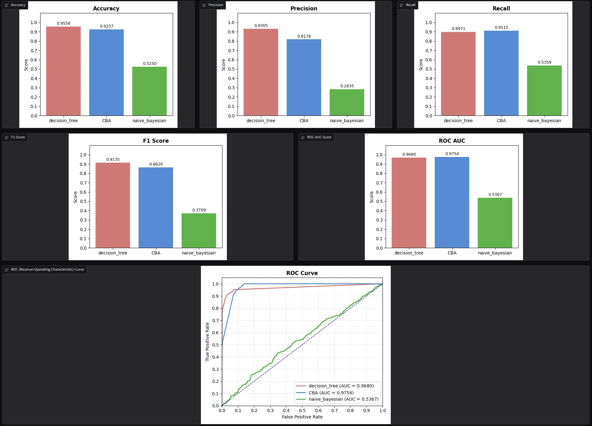
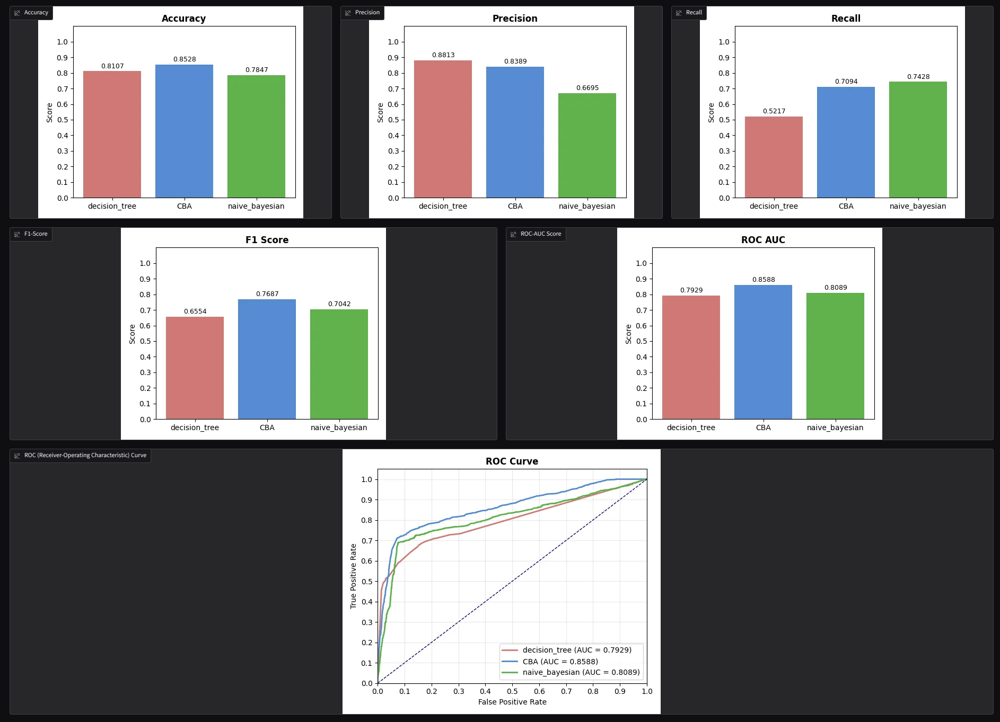

# BLM3120 Term Project

## Description
This is the source code for the term project of BLM3120 Information Retrieval and Search Engines course.

The system only supports datasets with instances that have atomic data types (str, int, float, bool). Continuous numerical values (int, float) are handled via binary splitting in the Decision Tree and require discretization for CBA and Naive Bayesian.

After installation, the user might choose to use the project in CLI mode, or use the GUI (visualization and performance comparison plots are only supported in GUI mode), or skip both and use `autorun_defaults.sh` to run the program with default parameters for whichever default dataset they desire, see usage section for details.

Currently the project has 2 churn classification datasets:
- spotify churn dataset (8K rows, 12 columns, ~ 25% churned)
- customer churn dataset (20K rows, 11 column, ~ 34% churned)

`autorun_defaults.sh` supports these two datasets. If the user desires to use another dataset, they must run `process_dataset` subcommand of `main` to split the dataset into testset and trainset that the project can use.

The following snippet shows how a data specified as bool in the `field_types` is converted to `bool` internally. If a dataset uses another form to represent boolean values, the dataset must be preprocessed.
```
if f == 'No' or f == 'no' or f == 'NO' or f == 'False' or f == 'false' or f == 'FALSE' or f == 0 or f == '0':
    as_bool = False
elif f == 'Yes' or f == 'yes' or f == 'YES' or f == 'True' or f == 'true' or f == 'TRUE' or f == 1 or f == '1':
    as_bool = True
```

## Requirements
- python3
- dot (GUI uses python's graphviz module to render the decision tree)


## Installation
```
git clone https://github.com/0xSELAMI/BLM3120TermProject
cd BLM3120TermProject
python3 -m venv env
source env/bin/activate
./main.py ... -- ready to use
```

## Usage

### autorunner bash script
```
./autorun_defaults.sh
    Usage: ./autorun_defaults.sh {spotify_churn_build, spotify_churn_eval, spotify_churn_all, customer_churn_build, customer_churn_eval, customer_churn_all}
    Description: Use this script to easily run the main script with default values
```

### Python scripts 
What follows is the usages for each command and parameter descriptions. Running with GUI just spawns gradio server on localhost.

#### main
```
usage: ./main.py [-h]
                 {GUI,process_dataset,decision_tree,CBA,naive_bayesian} ...

A python script to oversee and fulfill the functionalities the project
proposal document specifies

options:
  -h, --help            show this help message and exit

commands:
  {GUI,process_dataset,decision_tree,CBA,naive_bayesian}
    GUI                 Starts the gradio GUI
    process_dataset     Create testset and trainset from supplied dataset
    decision_tree       Build or evaluate a decision tree
    CBA                 Generate a CAR (Class Association Rule) classifier or
                        evaluate a CAR classifier
    naive_bayesian      Build a naive bayesian classifier probability table or
                        evaluate one

StudentID: [REDACTED]
```

#### process_dataset
```
usage: ./main.py process_dataset [-h] [--dataset PATH_TO_DATASET] [--ratio RATIO] [--trainset-outfile TRAINSET_OUTPATH] [--testset-outfile TESTSET_OUTPATH] [--field-types FIELD_TYPES [FIELD_TYPES ...]]
                                 [--ignore-indices IGNORE_INDICES [IGNORE_INDICES ...]] [--label-idx LABEL_IDX]

Create testset and trainset from supplied dataset

options:
  -h, --help            show this help message and exit
  --dataset PATH_TO_DATASET, -d PATH_TO_DATASET
                        default: dataset/spotify_churn_dataset/spotify_churn_dataset.csv
  --ratio RATIO, -r RATIO
                        ratio of the size of the testset to the size of whole dataset (default: 0.2)
  --trainset-outfile TRAINSET_OUTPATH
                        default: dataset/spotify_churn_dataset/default_trainset.json
  --testset-outfile TESTSET_OUTPATH
                        default: dataset/spotify_churn_dataset/default_testset.json
  --field-types FIELD_TYPES [FIELD_TYPES ...]
                        the data types instances of the dataset consist of, given sequentially and space seperated. default: ['int', 'str', 'int', 'str', 'str', 'int', 'int', 'float', 'str', 'int', 'bool', 'bool']
  --ignore-indices IGNORE_INDICES [IGNORE_INDICES ...]
                        field indices to exclude from resulting datasets, space seperated. -1 includes everything. default: [0]
  --label-idx LABEL_IDX
                        default: 11

```

#### decision_tree
```
usage: ./main.py decision_tree build [-h] [--trainset-infile TRAINSET_FILEPATH] [--pickle-path PICKLE_PATH] [--use-gini] [--entropy-weights WEIGHT_TRUE WEIGHT_FALSE] [--max-depth MAX_DEPTH]
                                     [--min-info-gain MIN_INFO_GAIN] [--min-samples-split MIN_SAMPLES_SPLIT] [--min-samples-leaf MIN_SAMPLES_LEAF] [--min-samples-leaf-kary MIN_SAMPLES_LEAF_KARY]
                                     [--dot-outfile DOT_OUTPUT_FILEPATH]

Build the decision tree and save into a pickle file, also create a DOT file

options:
  -h, --help            show this help message and exit
  --trainset-infile TRAINSET_FILEPATH
                        default: dataset/spotify_churn_dataset/default_trainset.json
  --pickle-path PICKLE_PATH
                        default: pickles/spotify_churn_dataset/default_decision_tree.pickle
  --use-gini            Use Gini impurity instead of entropy (default: False)
  --entropy-weights WEIGHT_TRUE WEIGHT_FALSE, -e WEIGHT_TRUE WEIGHT_FALSE
                        Entropy weights for true and false labels respectively (default: [3.0, 1.0])
  --max-depth MAX_DEPTH
                        Max decision tree depth (default: 24)
  --min-info-gain MIN_INFO_GAIN, -g MIN_INFO_GAIN
                        Minimum info gain for a split to qualify as one (default: 0.0001)
  --min-samples-split MIN_SAMPLES_SPLIT
                        Minimum samples a meaningful split should have (default: 4)
  --min-samples-leaf MIN_SAMPLES_LEAF
                        Minimum samples a leaf node should have (default: 2)
  --min-samples-leaf-kary MIN_SAMPLES_LEAF_KARY
                        Minimum samples a leaf node of a k-ary node should have (default: 0)
  --dot-outfile DOT_OUTPUT_FILEPATH, -o DOT_OUTPUT_FILEPATH
                        Path to write the dotfile of the decision tree to (default: dotfiles/spotify_churn_dataset/default_decision_tree.dot)


usage: ./main.py decision_tree evaluate [-h] [--testset-infile TESTSET_FILEPATH] [--pickle-path PICKLE_PATH]

Evaluate the supplied decision tree using the test set

options:
  -h, --help            show this help message and exit
  --testset-infile TESTSET_FILEPATH
                        default: dataset/spotify_churn_dataset/default_testset.json
  --pickle-path PICKLE_PATH
                        default: pickles/spotify_churn_dataset/default_decision_tree.pickle

```
#### CBA
```
usage: ./main.py CBA generate [-h] [--trainset-infile TRAINSET_FILEPATH] [--entropy-weights WEIGHT_TRUE WEIGHT_FALSE] [--max-split-count MAX_SPLIT_COUNT] [--min-bin-frac MIN_BIN_FRACTION] [--delta-cost DELTA_COST]
                              [--pickle-path PICKLE_PATH] [--max-k MAX_K] [--min-support MIN_SUP] [--min-confidence MIN_CONF] [--min-lift MIN_LIFT] [--error-weights WEIGHT_FALSE_POSITIVES WEIGHT_FALSE_NEGATIVES]
                              [--m-estimate-weights WEIGHT_M_ESTIMATE_TRUE WEIGHT_M_ESTIMATE_FALSE]

Generate a classifier and save into a pickle file

options:
  -h, --help            show this help message and exit
  --trainset-infile TRAINSET_FILEPATH
                        default: dataset/spotify_churn_dataset/default_trainset.json
  --entropy-weights WEIGHT_TRUE WEIGHT_FALSE
                        Entropy weights to use for true and false labels respectively while discretizing numeric features (default: [3.0, 1.0])
  --max-split-count MAX_SPLIT_COUNT, -m MAX_SPLIT_COUNT
                        Max split count to consider while discretizing numeric features (default: 3)
  --min-bin-frac MIN_BIN_FRACTION
                        Minimum fraction of the training dataset a bin should cover while discretizing numeric features into multiple bins (default: 0.1)
  --delta-cost DELTA_COST
                        Minimum cost difference adding a new bin should make while discretizing numeric features into multiple bins (default: 0.001)
  --pickle-path PICKLE_PATH
                        default: pickles/spotify_churn_dataset/default_rules.pickle
  --max-k MAX_K         Max k value for the apriori algorithm (default: 6)
  --min-support MIN_SUP
                        Minimum support for the CARs (default: 0.0002)
  --min-confidence MIN_CONF
                        Minimum confidence for the CARs (default: 0.2)
  --min-lift MIN_LIFT   Minimum lift for the CARs (default: 1.05)
  --error-weights WEIGHT_FALSE_POSITIVES WEIGHT_FALSE_NEGATIVES
                        The weights to use for penalizing rules that incorrectly cover instances while building CAR classifier (default: [1.0, 1.5])
  --m-estimate-weights WEIGHT_M_ESTIMATE_TRUE WEIGHT_M_ESTIMATE_FALSE
                        The weights to decide how more likely it should be that a rule's prediction is correct than its label's random guess baseline (default: [2.0, 0.0])


usage: ./main.py CBA evaluate [-h] [--testset-infile TESTSET_FILEPATH]
                              [--pickle-path PICKLE_PATH]

Evaluate the supplied classifier using the test set

options:
  -h, --help            show this help message and exit
  --testset-infile TESTSET_FILEPATH
                        default:
                        dataset/spotify_churn_dataset/default_testset.json
  --pickle-path PICKLE_PATH
                        default:
                        pickles/spotify_churn_dataset/default_rules.pickle

```
#### naive_bayesian
```
usage: ./main.py naive_bayesian build [-h] [--trainset-infile TRAINSET_FILEPATH] [--pickle-path PICKLE_PATH] [--entropy-weights WEIGHT_TRUE WEIGHT_FALSE] [--max-split-count MAX_SPLIT_COUNT]
                                      [--min-bin-frac MIN_BIN_FRACTION] [--delta-cost DELTA_COST]

Build a naive bayesian classifier probability table using the trainset and save into a pickle file

options:
  -h, --help            show this help message and exit
  --trainset-infile TRAINSET_FILEPATH
                        default: dataset/spotify_churn_dataset/default_trainset.json
  --pickle-path PICKLE_PATH
                        default: pickles/spotify_churn_dataset/default_probability_table.pickle
  --entropy-weights WEIGHT_TRUE WEIGHT_FALSE
                        Entropy weights to use for true and false labels respectively while discretizing numeric features (default: [3.0, 1.0])
  --max-split-count MAX_SPLIT_COUNT, -m MAX_SPLIT_COUNT
                        Max split count to consider while discretizing numeric features (default: 3)
  --min-bin-frac MIN_BIN_FRACTION
                        Minimum fraction of the training dataset a bin should cover while discretizing numeric features into multiple bins (default: 0.1)
  --delta-cost DELTA_COST
                        Minimum cost difference adding a new bin should make while discretizing numeric features into multiple bins (default: 0.001)


usage: ./main.py naive_bayesian evaluate [-h] [--testset-infile TESTSET_FILEPATH] [--pickle-path PICKLE_PATH]

Evaluate a naive bayesian classifier probability table using the supplied testset

options:
  -h, --help            show this help message and exit
  --testset-infile TESTSET_FILEPATH
                        default: dataset/spotify_churn_dataset/default_testset.json
  --pickle-path PICKLE_PATH
                        default: pickles/spotify_churn_dataset/default_probability_table.pickle

```

### Screenshots

#### Performance with spotify_churn


#### Performance with customer_churn (same hyperparams)

